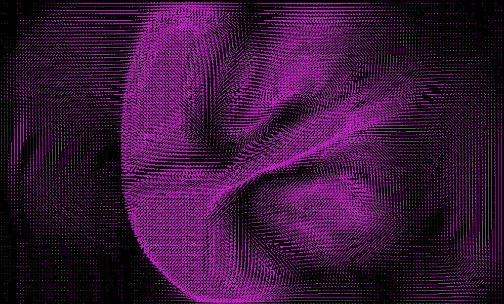
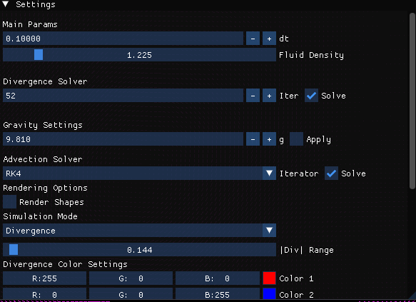
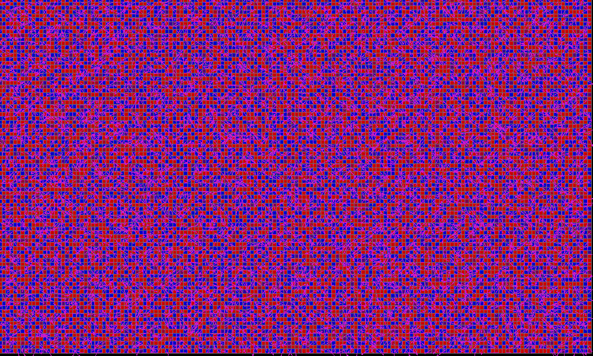
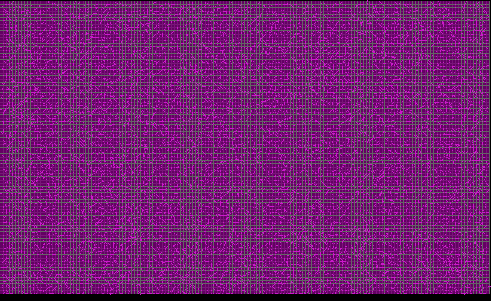
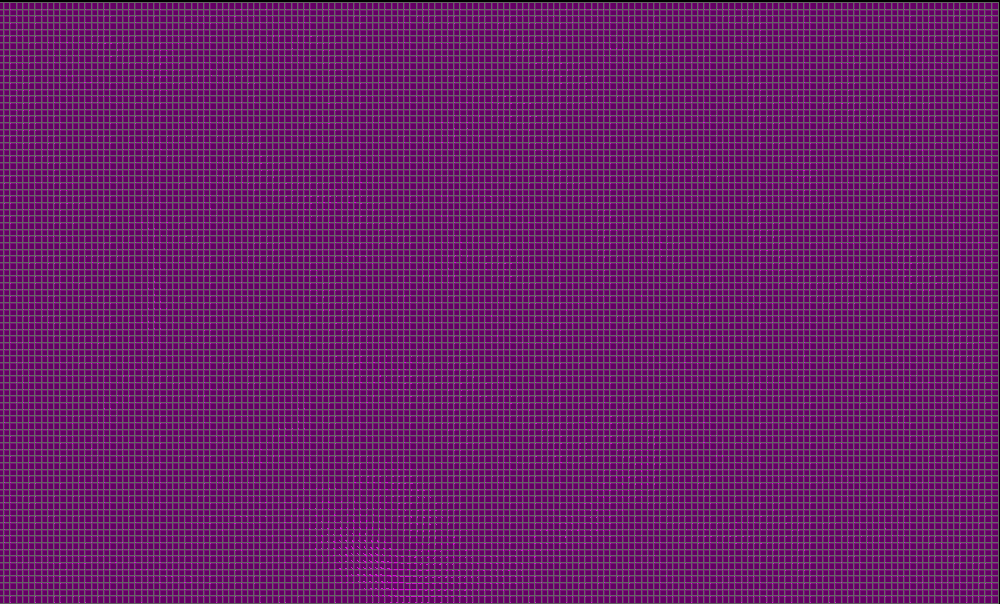
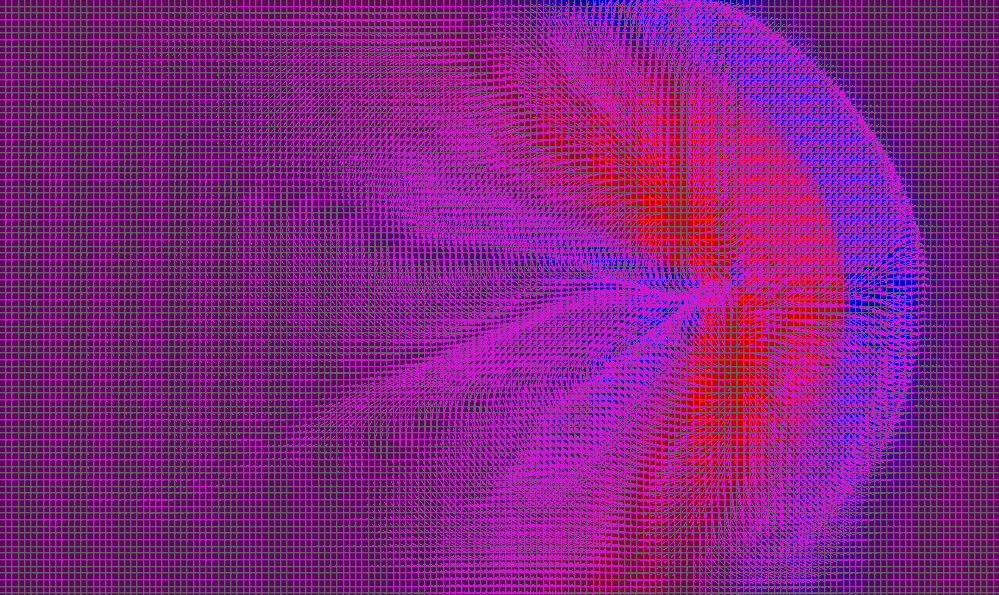

# Pressure Projection Solver

## How to run:
### With Makefile on Linux
1. Build it:
	```bash
	make
	```
2. Run the executable:
	```bash
	./fluid_sim
	```

This path uses `pkg-config` for SFML, so it is less tied to `/usr/local` and should work on more Linux setups as long as the SFML development packages are installed.

### With CMake
1. Configure the project:
	```bash
	cmake -S . -B build
	```
2. Build it:
	```bash
	cmake --build build
	```
	If you use a Visual Studio generator on Windows, build a specific config with `cmake --build build --config Release`.
3. Run the executable:
	```bash
	./build/fluid_sim
	```
	On Windows with a Visual Studio generator, the executable will usually be under `build/Release/fluid_sim.exe` or `build/Debug/fluid_sim.exe`.

### Requirements
- CMake 3.16 or newer
- SFML installed and available to CMake
- A C++20 compiler

### Notes
- The project currently builds the CPU/SFML path only.
- CUDA support is still under development and is not included in this build.
## How to use
 - To run the sim properly, turn on the divergence solver.
- Next, turn on the advection solver.
For a better (according to be) aesthetic display, check off `Render Shapes` option

- Increase the iterations of the divergence solver will make the fluid more incompressible, also having the side effect of speeding up any pressure/velocity waves you generate. 

- You can generate waves by dragging the mouse along the simulation

Before divergence solver:

After divergence solver:

After advection solver:

Make waves with your mouse!

## Specifications
- Inviscid fluid solver
- MAC grid for storing velocities
- Bilinear interpolation for velocity
- RK4 and RK2 options for semi-largrangian advection
- Gauss-Seidel Solver for pressure (in process of being converted to parallelized jacobi)
- Various rendering options
  - Edge velocities
  - Flow fields
  - Cell pressure
  - Cell Divergence 
  
